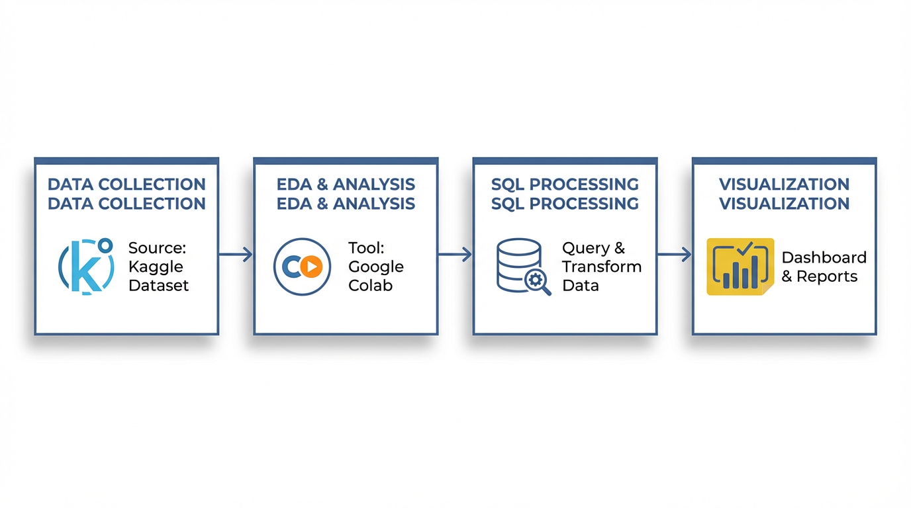
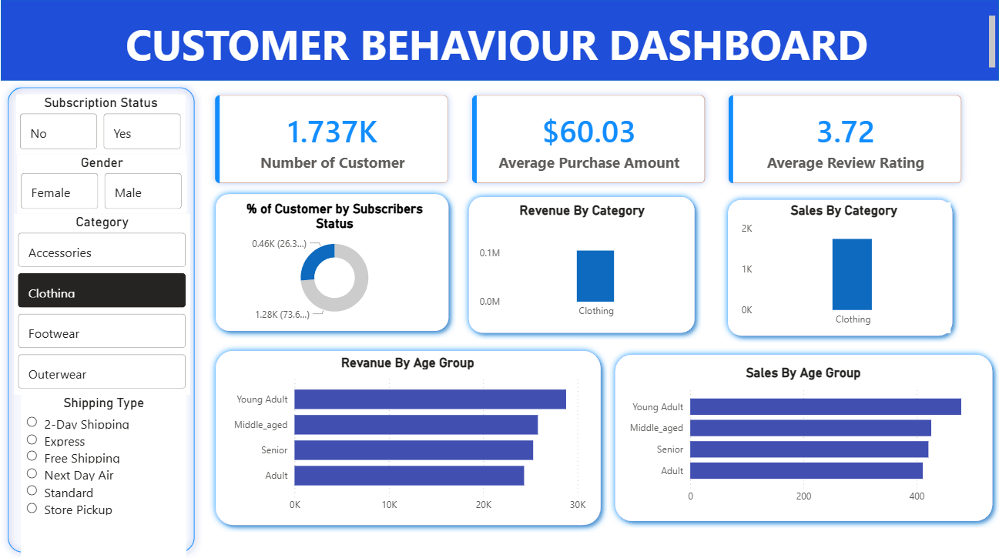
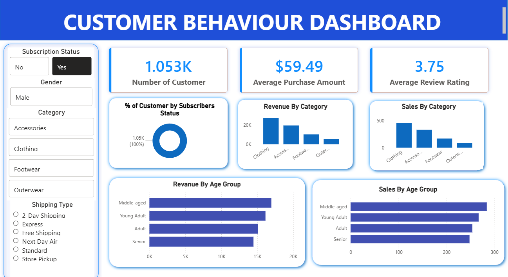
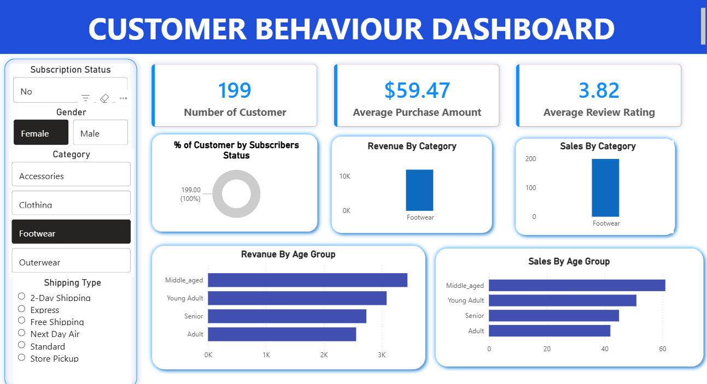

  
# Customer Trend Analysis


This project focuses on analyzing customer shopping behavior to identify key trends, extract valuable business insights, and present these findings through a comprehensive suite of tools including data processing notebooks, SQL queries, interactive dashboards, and formal reports. It provides a complete workflow from raw data to actionable business intelligence.

## 📑 Table of Contents

- [Project Overview](#project-overview)
- [Data Summary](#dataset-summary)
- [Features](#features)
- [Business Impact Delivered](#business-impact-delivered)
- [Tech Stack and Dependencies](#tech-stack-and-dependencies)
- [Installation](#installation)
  - [Prerequisites](#prerequisites)
  - [Clone the Repository](#clone-the-repository)
  - [Install Python Dependencies](#install-python-dependencies)
- [Usage](#usage)
  - [Data Cleaning and Initial Analysis](#1-data-cleaning-and-initial-analysis)
  - [Exploring Business Insights with SQL](#2-exploring-business-insights-with-sql)
  - [Interactive Dashboard](#3-interactive-dashboard)
  - [Reviewing Reports](#4-reviewing-reports)
- [Project Workflow](#project-workflow)
- [Project Structure](#project-structure)
- [Visualizations](#visualizations)
- [Contributing](#contributing)
- [License](#license)

## Project Overview

The objective of this project is to analyze customer purchase behavior across 3,900 transactions and multiple product categories. By combining Python, SQL, and Power BI, the project delivers insights that help businesses:

Understand customer spending behavior

Identify high-value customers

Evaluate the impact of discounts and subscriptions

Improve product positioning and marketing strategies

## Dataset Summary

Total Records: 3,900 purchases

Total Features: 18 columns

### Key Data Attributes

Customer Demographics: Age, Gender, Location, Subscription Status

Purchase Details: Item Purchased, Category, Purchase Amount, Season, Size, Color

Shopping Behavior: Discount Applied, Promo Code Used, Previous Purchases, Frequency of Purchases, Review Rating, Shipping Type

### Data Quality Notes

Missing values found in the Review Rating column (37 records)

Missing ratings were imputed using the median rating per product category

## Features

*   **Data Ingestion & Storage**: Manages the raw customer shopping behavior data, typically in CSV format.
*   **Data Cleaning & Preprocessing**: Utilizes Python and Jupyter Notebooks for cleaning, transforming, and performing initial exploratory data analysis.
*   **SQL-based Insight Extraction**: Contains SQL queries specifically designed to uncover business insights and trends from the processed data.
*   **Interactive Dashboarding**: Develops an interactive dashboard using Microsoft Power BI for dynamic visualization and exploration of customer trends.
*   **Static Reporting**: Generates static reports (PDF) and presentations (PPTX) to summarize key findings, recommendations, and project outcomes.
*   **Comprehensive Documentation**: Provides a detailed `README.md` for project overview and usage instructions.
  
##  Business Impact Delivered
* **Customer segmentation** by spending patterns (High/Medium/Low value)
* **Revenue insights** - Top products/categories by sales contribution  
* **Peak shopping hours** analysis for inventory optimization
* **Churn prediction** factors identification
  
## Tech Stack and Dependencies

This project leverages a combination of programming languages and specialized tools for data analysis and visualization.

*   **Languages**:
    *   Python
    *   SQL
*   **Frameworks/Tools**:
    *   Jupyter Notebook (for Python-based data analysis)
    *   Microsoft Power BI Desktop (for interactive dashboards)
*   **Key Python Libraries (Inferred)**:
    *   `pandas`: For data manipulation and analysis.
    *   `numpy`: For numerical operations.
    *   `matplotlib`: For static data visualization.
    *   `seaborn`: For enhanced statistical data visualization.
*   **Data Storage**: CSV files.

## Installation

To set up and run this project locally, follow these steps:

### Prerequisites

Ensure you have the following software installed:

*   **Python 3.x**: Download from [python.org](https://www.python.org/).
*   **Jupyter Notebook**: Usually installed with Anaconda distribution, or via pip:
    ```bash
    pip install notebook
    ```
*   **Microsoft Power BI Desktop**: Download from [powerbi.microsoft.com](https://powerbi.microsoft.com/desktop/).
*   **A SQL Client**: To execute SQL queries (e.g., MySQL Workbench, pgAdmin, DBeaver, or a simple command-line client).

### Clone the Repository

First, clone the project repository to your local machine:

```bash
git clone https://github.com/girish-indurkar/customer_trends_analysis.git
cd Customer-trend-analysis
```

### Install Python Dependencies

Navigate to the project directory and install the required Python libraries:

```bash
pip install pandas numpy matplotlib seaborn
```

## Usage

This project is structured to guide you through data processing, analysis, and visualization.

### 1. Data Cleaning and Initial Analysis

The `data_cleaning_and_load.ipynb` notebook handles the initial data processing.

*   **Open Jupyter Notebook**:
    ```bash
    jupyter notebook notebooks/data_cleaning_and_load.ipynb
    ```
*   Run through the cells in the notebook to clean the raw data (`data/customer_shopping_behavior.csv`), perform exploratory data analysis, and prepare it for further insights.

### 2. Exploring Business Insights with SQL

The `business_insights_queries.sql` file contains various SQL queries to extract specific trends and insights from your customer data.

*   **Execute SQL Queries**:
    Open `SQL/business_insights_queries.sql` in your preferred SQL client (e.g., MySQL Workbench, pgAdmin, or a command-line interface). Connect to your database containing the customer shopping behavior data and execute the queries to retrieve business insights.

### 3. Interactive Dashboard

The interactive Power BI dashboard provides a dynamic way to visualize customer trends.

*   **Open Power BI Dashboard**:
    Open `dashboard/customer trend analysis.pbix` with Microsoft Power BI Desktop to explore the interactive visualizations and filters.

### 4. Reviewing Reports

Static reports and presentations summarizing the key findings are available for review.

*   **View Reports**:
    Navigate to the `reports/` directory to view the generated PDF report (`Customer_Shopping_Behavior_Analysis.pdf`) and the PowerPoint presentation (`customer_trends_analysis.pptx`).

## Project Workflow
<p align="center">
  
</p>

## Project Structure

The repository is organized into several directories, each serving a specific purpose:

```
customer_trends_analysis/
│
├── data/
│   └── customer_shopping_behavior.csv
│
├── notebooks/
│   └── data_cleaning_and_load.ipynb
│
├── SQL/
│   └── business_insights_queries.sql
│
├── dashboards/
│   └── customer_behavior_dashboard.pbix
│
├── reports/
│   ├── Business_Problem.pdf
│   ├── Analysis_Report.pdf
│   └── Presentation.pptx
│
├── README.md
├── License.txt
└── requirements.txt   
```
---

## Visualizations

### 1) Revenue by Category
<p align="center">
  
</p>
<p align="center"><i>Category-wise revenue distribution to identify top-performing product lines.</i></p>

---

### 2) Customer Segments (Subscribers vs Non-Subscribers)
<p align="center">
  
</p>
<p align="center"><i>Segmentation view showing subscriber vs non-subscriber customer split.</i></p>

---

### 3) Age Group Analysis
<p align="center">
  
</p>
<p align="center"><i>Age-group performance comparison for campaign targeting and personalization.</i></p>

---
## Contributing

Contributions are welcome! If you have suggestions for improvements, new features, or bug fixes, please follow these steps:

1.  Fork the repository.
2.  Create a new branch (`git checkout -b feature/AmazingFeature`).
3.  Make your changes.
4.  Commit your changes (`git commit -m 'Add some AmazingFeature'`).
5.  Push to the branch (`git push origin feature/AmazingFeature`).
6.  Open a Pull Request.

## License
This project is licensed under the MIT License - see the LICENSE file for details 
